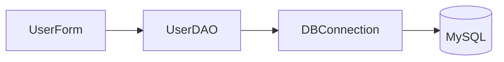

# 🚀 JavaProject — Simple Java + MySQL User Management

[](https://github.com/nakul2611/JavaProject)
[](https://github.com/nakul2611/JavaProject)
[]()

A compact, focused Java learning/demo project that shows direct JDBC usage for basic user management. This README is tailored to the repository's actual contents and explains how to run, configure, secure, and evolve the project — without any Docker content.

---

## Table of Contents

- 🎯 Project Purpose
- 🧩 Visual Architecture
- 📁 Repository Contents
- ⚙️ Tech Stack (project-specific)
- 🔧 Configuration (DB credentials — IMPORTANT)
- ▶️ Build & Run (Local)
- 🛡 Security & Hardening
- 🛠 Recommended Improvements & Roadmap
- 📽 Demo Asset
- 📬 Maintainer & Next Steps

---

🎯 Project Purpose
------------------
This repository is a small Java application demonstrating direct JDBC access to a MySQL database. It is intended for learning or as a minimal starting point for a small CLI/form-driven user-management utility.

Core files present:
- DBConnection.java / DBConnection.class — establishes JDBC connection
- UserDAO.java / UserDAO.class — data access object for user CRUD operations
- UserForm.java / UserForm.class — UI/entrypoint (form/console)
- mysql-connector-j-9.4.0.jar — bundled MySQL JDBC driver (recommended to remove and use Maven)
- JavaProject.mp4 — demo / walkthrough video

---

🧩 Visual Architecture (simple)
```text
[UserForm (UI / CLI)] <--> [UserDAO (CRUD methods)] <--> [DBConnection (JDBC)] --> [MySQL Database]
```

Mermaid :


Responsibilities:
- UserForm: captures user input and triggers operations.
- UserDAO: executes SQL queries and maps results.
- DBConnection: loads driver and returns Connection.

---

📁 Repository Contents (root)
- .gitattributes
- DBConnection.java
- DBConnection.class
- UserDAO.java
- UserDAO.class
- UserForm.java
- UserForm.class
- mysql-connector-j-9.4.0.jar
- JavaProject.mp4

Note: There is currently no build system (Maven/Gradle). Source and compiled classes are present alongside a bundled driver jar.

---

⚙️ Tech Stack (as used in this repo)
- Language: Java (source files provided; compatible with Java 8+; Java 11/17 recommended)
- Database: MySQL (jdbc URL in DBConnection.java)
- Persistence: Plain JDBC via DriverManager (no ORM)
- Driver: mysql-connector-j-9.4.0.jar (bundled)
- Build: manual javac / jar commands (recommended migration to Maven/Gradle)

---

🔧 Configuration (IMPORTANT)
DBConnection.java currently contains hard-coded connection details. Current values (from the file):

```java
private static String jdbcURL = "jdbc:mysql://localhost:3306/userdb?useSSL=false&serverTimezone=UTC";
private static String jdbcUsername = "root";
private static String jdbcPassword = "nakul123";
```

What you must do:
1. Update these to match your local MySQL instance OR
2. Replace hard-coded values with environment-variable lookups (recommended).

Example safe refactor to use environment variables:
```java
private static String jdbcURL = System.getenv().getOrDefault("JDBC_URL",
    "jdbc:mysql://localhost:3306/userdb?useSSL=false&serverTimezone=UTC");
private static String jdbcUsername = System.getenv().getOrDefault("JDBC_USER", "root");
private static String jdbcPassword = System.getenv().getOrDefault("JDBC_PASS", "");
```

After refactor, set environment variables before running:
- Linux/macOS:
  export JDBC_URL="jdbc:mysql://localhost:3306/userdb?useSSL=false&serverTimezone=UTC"
  export JDBC_USER="appuser"
  export JDBC_PASS="strongpass"
- Windows (PowerShell):
  $env:JDBC_URL="jdbc:mysql://localhost:3306/userdb?useSSL=false&serverTimezone=UTC"
  $env:JDBC_USER="appuser"
  $env:JDBC_PASS="strongpass"

---

▶️ Build & Run (Local, no Docker)
Follow these steps to run the project locally.

1) Ensure MySQL is running and the database (userdb) exists. Create DB and user if needed:

```sql
CREATE DATABASE userdb;
CREATE USER 'appuser'@'localhost' IDENTIFIED BY 'appsecret';
GRANT ALL PRIVILEGES ON userdb.* TO 'appuser'@'localhost';
FLUSH PRIVILEGES;
```

2) Compile Java sources

macOS / Linux:
```bash
javac -cp .:mysql-connector-j-9.4.0.jar DBConnection.java UserDAO.java UserForm.java
```

Windows (CMD / PowerShell):
```cmd
javac -cp .;mysql-connector-j-9.4.0.jar DBConnection.java UserDAO.java UserForm.java
```

3) Run the application (replace MainClass if UserForm is not the main entry):

macOS / Linux:
```bash
java -cp .:mysql-connector-j-9.4.0.jar UserForm
```

Windows:
```cmd
java -cp .;mysql-connector-j-9.4.0.jar UserForm
```

4) Troubleshooting:
- "ClassNotFoundException: com.mysql.cj.jdbc.Driver" — ensure classpath includes mysql-connector-j-9.4.0.jar.
- "Access denied" — verify DB user and host permissions.
- "Unknown database" — create the database first.

---

🛡 Security & Hardening (must-read)
- DO NOT keep credentials in source. Move to environment variables or configuration files excluded from VCS.
- Use a least-privileged DB user (avoid root).
- Use PreparedStatement for all SQL with parameters to prevent SQL injection. If UserDAO uses string concatenation, migrate those statements immediately.
- Remove the bundled JDBC jar from the repository and manage dependencies using Maven/Gradle (pom.xml or build.gradle). That allows vulnerability scanning and easier upgrades.
- Add logging (SLF4J + Logback) instead of printing stack traces.
- Use TLS for DB connections in production environments.

---

🛠 Recommended Improvements & Roadmap
Short-term (recommended now)
- Refactor DBConnection to read env vars.
- Replace any string-concatenated SQL with PreparedStatement.
- Remove mysql-connector jar from repo and add a Maven pom (I can create one).
- Add a README section with example SQL schema and sample data.

Medium-term
- Migrate to a minimal build system (Maven/Gradle) and create a proper artifact (jar).
- Add unit tests and integration tests (use Testcontainers for DB integration).
- Add logging and structured error handling.

Long-term
- If you want web UI or REST API, convert to a Servlet-based app or migrate into a Spring Boot service with proper layered architecture (controllers, services, repos).
- Add CI (GitHub Actions) to build and run tests automatically.

---

📽 Demo Asset
- JavaProject.mp4 — walkthrough/demo video included in the repo.

---

📬 Maintainer & Next Steps
- Maintainer: nakul2611
- Repo: https://github.com/nakul2611/JavaProject
